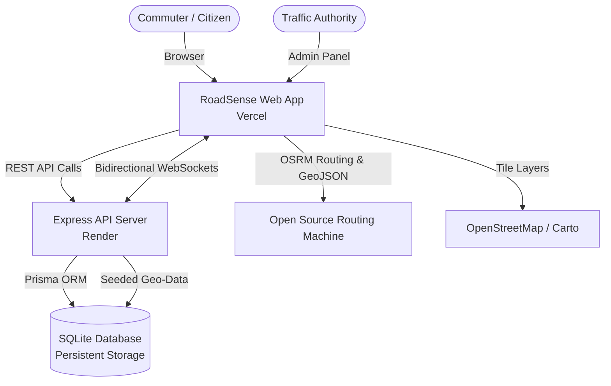

# RoadSense — Intelligent Traffic Management System

<p align="center">
  
  
  
  
</p>

<p align="center">
  <b>A real-time, production-ready intelligent traffic monitoring, incident reporting, and turn-by-turn route navigation platform.</b>
</p>

---

## 🌐 Live Deployments

| Component | Platform | Live URL | Status |
|---|---|---|---|
| **Web Application** | **Vercel** | [https://stms-flame-alpha.vercel.app](https://stms-flame-alpha.vercel.app) |  |
| **Alternate Mirror** | **Vercel** | [https://frontend-three-gilt-44.vercel.app](https://frontend-three-gilt-44.vercel.app) |  |
| **Backend API** | **Render** | [https://roadsense-dubz.onrender.com](https://roadsense-dubz.onrender.com) |  |
| **API Health Check** | **Render** | [https://roadsense-dubz.onrender.com/health](https://roadsense-dubz.onrender.com/health) |  |
| **Source Code** | **GitHub** | [https://github.com/piyush-ghoshi/RoadSense](https://github.com/piyush-ghoshi/RoadSense) |  |

---

## ⚡ Key Highlights

- **Universal Design System**: Clean, dark-navy aesthetic (`Inter` + `Outfit` typography, curated HSL color tokens, zero emojis, fully responsive flex layout).
- **Intelligent Route Planner**:
  - Side-by-side **horizontal flex cards** for route selection (**Fastest Route**, **Shortest Route**, **Avoid Congestion**).
  - Real road network geometries with turn-by-turn maneuvers powered by **OSRM (Open Source Routing Machine)**.
  - Interactive OpenStreetMap view with custom **🚩 START** and **🏁 FINISH** markers, glowing polylines, and clickable alternatives.
- **GPS Location Detection**: Instant HTML5 Geolocation (**"My Location"**) with live radar-pulsing GPS markers.
- **Live Travelling Navigation Mode**:
  - Real-time turn-by-turn HUD (maneuver arrows, next-turn instructions).
  - Dynamic speedometer (`km/h`), live ETA countdown, remaining distance, and progress bar (`0% → 100%`).
  - Animated vehicle navigation marker following real highway and street paths.
- **Real-Time Traffic Heatmap**: Color-coded congestion intensity layers powered by `leaflet.heat` with time-range filtering.
- **Community Incident Reporting**: Citizens report roadblocks, accidents, and hazards with auto-categorization and severity tagging.
- **Authority Portal**: Secure 6-digit OTP verification system, kanban triage board, and system-wide broadcast alerts.
- **Persistent Real-Time Sync**: Low-latency bidirectional WebSocket updates powered by **Socket.IO**.

---

## 🏗️ Architecture Overview



---

## 🛠️ Tech Stack

### Frontend
- **Framework**: React 19 + TypeScript
- **Bundler & Tooling**: Vite (Rolldown)
- **Routing**: React Router v7 (SPA with Vercel rewrites)
- **State & Server Cache**: TanStack React Query v5
- **Mapping & GIS**: Leaflet 1.9, Leaflet Heat, Leaflet MarkerCluster, OpenStreetMap
- **Icons**: Lucide React
- **Charts**: Recharts
- **Styling**: Custom CSS Design System (50+ semantic tokens, responsive flexbox & CSS grid)
- **Deployment**: Vercel

### Backend
- **Runtime**: Node.js 20+ (TypeScript)
- **Framework**: Express 5
- **Real-Time Communication**: Socket.IO
- **Database & ORM**: Prisma ORM with SQLite
- **Validation**: Zod 4
- **Email Service**: Nodemailer (with fallback dev mode)
- **Deployment**: Render Web Service (`render.yaml`)

---

## 📂 Project Structure

```
RoadSense/
├── frontend/                   # React + TypeScript Vite client
│   ├── src/
│   │   ├── components/         # Layout, OSMMap, Navigation HUD
│   │   ├── pages/              # Dashboard, TrafficMap, Heatmap, RouteSuggestion, Reports, Analytics, Authority
│   │   ├── lib/                # API client, Socket.io client, OSRM routingService
│   │   ├── index.css           # Global reset, design tokens, typography
│   │   └── theme.css           # Semantic color variables, keyframe animations
│   ├── vercel.json             # Vercel SPA client-side rewrite rules
│   └── package.json
│
├── backend/                    # Express + Socket.IO + Prisma server
│   ├── prisma/
│   │   └── schema.prisma       # Database schema (Reports, Snapshots, Alerts, Users)
│   ├── src/
│   │   ├── routes/             # Reports, Traffic, Analytics, Alerts, Routes, Auth
│   │   ├── lib/                # Prisma client singleton
│   │   ├── seed.ts             # Initial data seeder (Indore, Mumbai, Delhi, Bangalore)
│   │   └── index.ts            # Server entrypoint, CORS configuration & Socket.IO handlers
│   └── package.json
│
├── render.yaml                 # Render Blueprint configuration
├── vercel.json                 # Monorepo root Vercel build configuration
└── package.json                # Monorepo root scripts
```

---

## 🚀 Quickstart Guide

### Prerequisites
- [Node.js](https://nodejs.org/) (v18 or higher)
- [npm](https://www.npmjs.com/) (v9 or higher)
- [Git](https://git-scm.com/)

### 1. Clone Repository
```bash
git clone https://github.com/piyush-ghoshi/RoadSense.git
cd RoadSense
```

### 2. Install & Start Backend
```bash
cd backend
npm install
npx prisma generate
npx prisma db push
npm run seed
npm run dev
```
Backend will start on `http://localhost:3000`.

### 3. Install & Start Frontend
In a new terminal window:
```bash
cd frontend
npm install
npm run dev
```
Frontend will be live at `http://localhost:5173`.

---

## 🔌 API Endpoints Reference

### Traffic & Routing
- `GET /api/traffic/live` — Retrieve live congestion snapshots and active traffic points
- `POST /api/traffic/snapshot` — Ingest sensor/camera traffic snapshot
- `POST /api/routes/suggest` — Calculate alternative routes based on congestion

### Incident Reports
- `GET /api/reports` — Fetch filtered citizen traffic reports (supports status, severity, date range)
- `POST /api/reports` — Submit new incident report (broadcasts via WebSocket `report:new`)
- `PATCH /api/reports/:id` — Update report status (`verified`, `resolved`, `false`)

### Alerts & Authority
- `GET /api/alerts` — Fetch active emergency and congestion broadcasts
- `POST /api/alerts` — Publish new alert (broadcasts via WebSocket `alert:new`)
- `POST /api/auth/send-otp` — Request authority verification 6-digit OTP
- `POST /api/auth/verify-otp` — Validate OTP and issue authority session token

---

## 🌍 Environment Variables

### Frontend (`frontend/.env`)
```env
VITE_API_URL=https://roadsense-dubz.onrender.com/api
```

### Backend (`backend/.env`)
```env
PORT=3000
NODE_ENV=production
FRONTEND_URL=https://stms-flame-alpha.vercel.app
DATABASE_URL="file:./dev.db"
```

---

## 📄 License

This project is licensed under the [MIT License](LICENSE).
